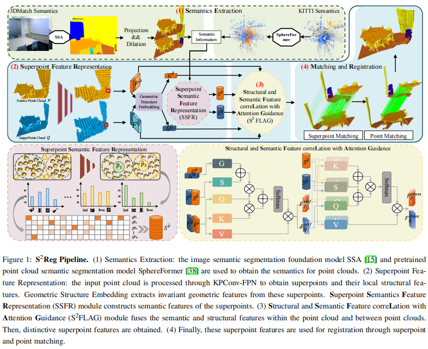

# S^2^Reg: Structure-Semantics Collaborative Point Cloud Registration

Zongyi Xu, Xinyu Gao, Xinqi Jiang, Shiyang Cheng, Qianni Zhang, Weisheng Li, Xinbo Gao

## Introduction

Point cloud registration is one of the essential tasks in 3D vision. However, most existing methods mainly
locate the point correspondences based on the geometric information or adopt semantic information to filter
out incorrect correspondences. They overlook the underlying correlation between semantics and structure.
In this paper, we propose a structure-semantics collaborative point cloud registration method. Firstly, we
propose a Superpoint Semantic Feature Representation module (SSFR), which incorporates multiple semantics of neighbouring points to characterize the semantics of superpoints. Then, through a Structural and
Semantic Feature correLation with Attention Guidance module (S^2^FLAG), we capture the global correlation of semantics and structure within a point cloud, as well as the consistency of semantics and structure
between point clouds. Moreover, an image semantic segmentation foundation model is employed to acquire semantics when images of the point clouds are available. Extensive experiments demonstrate that our
method achieves superior performance, especially in low-overlap scenarios.




## Installation

Please use the following command for installation.

```bash
# It is recommended to create a new environment
conda create -n geotransformer python==3.8
conda activate geotransformer

# [Optional] If you are using CUDA 11.0 or newer, please install `torch==1.7.1+cu110`
pip install torch==1.7.1+cu110 -f https://download.pytorch.org/whl/torch_stable.html

# Install packages and other dependencies
pip install -r requirements.txt
python setup.py build develop
```

Code has been tested with Ubuntu 20.04, GCC 9.3.0, Python 3.8, PyTorch 1.7.1, CUDA 11.1 and cuDNN 8.1.0.

## Pre-trained Weights

We provide pre-trained weights in the [release](https://github.com/qinzheng93/GeoTransformer/releases) page. Please download the latest weights and put them in `weights` directory.

## 3DMatch

### Data preparation

The 3DMatch dataset can be downloaded from [PREDATOR](https://github.com/prs-eth/OverlapPredator) and Semantic-3DMatch dataset can be downloaded from [Semantic-3DMatch](https://pan.baidu.com/s/1w_w5ZX4DoKBe3JkEcfrb3Q?pwd=m8m3) . The data should be organized as follows:

```text
--data--3DMatch--metadata
              |--data--train--7-scenes-chess--cloud_bin_0.pth
              |     |      |               |--...
              |     |      |--...
              |     |--test--7-scenes-redkitchen--cloud_bin_0.pth
              |            |               |--...
              |            |--...
              |--label--train--7-scenes-chess--cloud_bin_0.npy
                    |      |               |--...
                    |      |--...
                    |--test--7-scenes-redkitchen--cloud_bin_0.npy
                            |               |--...
``` 
### Training

The code for 3DMatch is in `experiments/geotransformer.3dmatch.stage4.gse.k3.max.oacl.stage2.sinkhorn`. Use the following command for training.

```bash
CUDA_VISIBLE_DEVICES=0 python trainval.py
```

### Testing

Use the following command for testing.

```bash
# 3DMatch
CUDA_VISIBLE_DEVICES=0 ./eval.sh EPOCH 3DMatch
# 3DLoMatch
CUDA_VISIBLE_DEVICES=0 ./eval.sh EPOCH 3DLoMatch
```

`EPOCH` is the epoch id.

We also provide pretrained weights in `weights`, use the following command to test the pretrained weights.

```bash
CUDA_VISIBLE_DEVICES=0 python test.py --snapshot=../../weights/geotransformer-3dmatch.pth.tar --benchmark=3DMatch
CUDA_VISIBLE_DEVICES=0 python eval.py --benchmark=3DMatch --method=lgr
```

Replace `3DMatch` with `3DLoMatch` to evaluate on 3DLoMatch.

## Kitti odometry

### Data preparation

Download the data from the [Kitti official website](http://www.cvlibs.net/datasets/kitti/eval_odometry.php) into `data/Kitti` and run `data/Kitti/downsample_pcd.py` to generate the data. Download the semantic data from  [Semantic-KITTI](https://pan.baidu.com/s/1YHGWaFfwP36r7fnnF6f0VA?pwd=959u) The data should be organized as follows:

```text
--data--Kitti--metadata
            |--sequences--00--velodyne--000000.bin
            |              |         |--...
            |              |...
            |--downsampled--00--000000.npy
            |            |   |--...
            |            |--...
            |--downsampled-label--00--000000.npy
                                  |     |--...
                                  |--...
```

### Training

The code for Kitti is in `experiments/geotransformer.kitti.stage5.gse.k3.max.oacl.stage2.sinkhorn`. Use the following command for training.

```bash
CUDA_VISIBLE_DEVICES=0 python trainval.py
```

### Testing

Use the following command for testing.

```bash
CUDA_VISIBLE_DEVICES=0 ./eval.sh EPOCH
```

`EPOCH` is the epoch id.

We also provide pretrained weights in `weights`, use the following command to test the pretrained weights.

```bash
CUDA_VISIBLE_DEVICES=0 python test.py --snapshot=../../weights/geotransformer-kitti.pth.tar
CUDA_VISIBLE_DEVICES=0 python eval.py --method=lgr
```


## Multi-GPU Training

As the point clouds usually have different sizes, we organize them in the *pack* mode. This causes difficulty for batch training as we need to convert the data between *batch* mode and *pack* mode frequently. For this reason, we limit the batch size to 1 per GPU at this time and support batch training via `DistributedDataParallel`. Use `torch.distributed.launch` for multi-gpu training:

```bash
CUDA_VISIBLE_DEVICES=GPUS python -m torch.distributed.launch --nproc_per_node=NGPUS trainval.py
```

Note that the learning rate is multiplied by the number of GPUs by default as the batch size increased. In our experiments, multi-gpu training slightly improves the performance.

## Results

### 3DMatch

We evaluate GeoTransformer on the standard 3DMatch/3DLoMatch benchmarks as in [PREDATOR](https://arxiv.org/abs/2011.13005).

| Benchmark |  FMR  |  IR   |  RR   |
| :-------- | :---: | :---: | :---: |
| 3DMatch   | 98.5  | 68.4  | 92.3  |
| 3DLoMatch | 90.8  | 42.6  | 76.4  |

### Kitti odometry

We evaluate GeoTransformer on the standard Kitti benchmark as in [PREDATOR](https://arxiv.org/abs/2011.13005).

| Benchmark |  RRE  |  RTE  |  RR   |
| :-------- | :---: | :---: | :---: |
| Kitti     | 0.227 |  6.3  | 99.8  |

## Acknowledgements

- [PREDATOR](https://github.com/prs-eth/OverlapPredator)
- [Geotransformer](https://github.com/qinzheng93/GeoTransformer)


